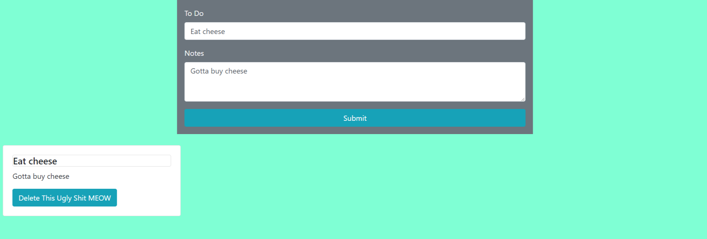

# Event Listeners

This exercise was meant to teach us Event Listeners. I learned how they worked, using the click method for instance, and how to remove cards as another example. Along with implementing the Event Listeners, we were taught how to use Bootstrap. 

# Screenshot



## How to run this project

* Use npm to install http-server in your terminal:
```sh
npm install -g http-server
```
* Run the server:
```sh
hs -p 9999
```
* Open Chrome and navigate to 
```
localhost:9999
```
